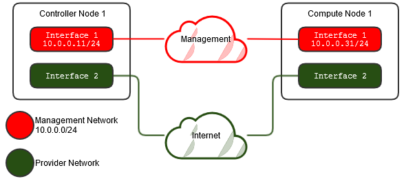

Host Networking
===============

After installing the operating system on each node in the architecture, you must configure the network interfaces.
It is recommended that you disable any automated network management tools and manually edit the network configuration files.

All nodes require Internet access for administrative purposes such as package installation, security updates, DNS, and NTP.
A separate management network is recommended to isolate management traffic from public Minecraft server traffic. Other
network topologies are supported but they will not be covered in this guide.

The example architectures assume use of the following networks:

    * Management on 10.0.0.0/24
    * Provider

The provider network is usually allocated by the dedicated server host and usually varies per node.

Unless you intend to use the exact network configuration provided in this example architecture, you must modify the networks
in this guide to match your environment. Each node also must resolve other nodes by name as well as IP address. For example,
the :code:`controller` name must resolve to :code:`10.0.0.11`, the IP address of the management interface on the controller node.

.. warning::

   It is recommened to use a local terminal session while reconfiguring network interfaces due to network
   connectivity interruptions.

.. note::

   Most Linux distributions enable a restrictive firewall by default. When installing Minestack certain steps will
   fail unless the firewall is altered or disabled.